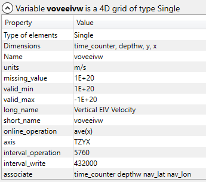

# Explore Data Set


# 1. dyna_grid_T.nc
## 1.1 info


## 2. variables/dimensions


## 3. description of variables/dimensions
### 3.1 [1] nav_lon of type Single (y:149) (x:182)


### 3.2 [2] nav_lat of type Single (y:149) (x:182)


### 3.3 [3] deptht of type Single (deptht:31)


### 3.4 [4] time_counter of type Single (time_counter:73)


### 3.5 [5] votemper of type Single (time_counter:73) (deptht:31) (y:149) (x:182)


### 3.6 [6] vosaline of type Single (time_counter:73) (deptht:31) (y:149) (x:182)


### 3.7 [7] sosstsst of type Single (time_counter:73) (y:149) (x:182)


### 3.8 [8] sosaline of type Single (time_counter:73) (y:149) (x:182)


### 3.9 [9] sossheig of type Single (time_counter:73) (y:149) (x:182)


### 3.10 [10] iowaflup of type Single (time_counter:73) (y:149) (x:182)


### 3.11 [11] sowaflep of type Single (time_counter:73) (y:149) (x:182)


### 3.12 [12] sowaflup of type Single (time_counter:73) (y:149) (x:182)


### 3.13 [13] sorunoff of type Single (time_counter:73) (y:149) (x:182)


### 3.14 [14] sowaflcd of type Single (time_counter:73) (y:149) (x:182)


### 3.15 [15] sosalflx of type Single (time_counter:73) (y:149) (x:182)


### 3.16 [16] sohefldo of type Single (time_counter:73) (y:149) (x:182)


### 3.17 [17] soshfldo of type Single (time_counter:73) (y:149) (x:182)


### 3.18 [18] somxl010 of type Single (time_counter:73) (y:149) (x:182)


### 3.19 [19] somixhgt of type Single (time_counter:73) (y:149) (x:182)


### 3.20 [20] soicecov of type Single (time_counter:73) (y:149) (x:182)


### 3.21 [21] sowindsp of type Single (time_counter:73) (y:149) (x:182)


### 3.22 [22] sohefldp of type Single (time_counter:73) (y:149) (x:182)


### 3.23 [23] sowafldp of type Single (time_counter:73) (y:149) (x:182)


### 3.24 [24] sosafldp of type Single (time_counter:73) (y:149) (x:182)


### 3.25 [25] sobowlin of type Single (y:149) (x:182)


# 2. dyna_grid_U.nc
## 1. info


## 2. variables/dimensions


## 3. description of variables/dimensions

### 3.1 [1] nav_lon of type Single (y:149) (x:182)


### 3.2 [2] nav_lat of type Single (y:149) (x:182)


### 3.3 [3] depthu of type Single (depthu:31)


### 3.4 [4] time_counter of type Single (time_counter:73)


### 3.5 [5] vozocrtx of type Single (time_counter:73) (depthu:31) (y:149) (x:182)


### 3.6 [6] sobblcox of type Single (time_counter:73) (y:149) (x:182)


### 3.7 [7] vozoeivu of type Single (time_counter:73) (depthu:31) (y:149) (x:182)


### 3.8 [8] sozotaux of type Single (time_counter:73) (y:149) (x:182)


# 3. dyna_grid_V.nc
## 1. info


## 2. variables/dimensions


## 3. description of variables/dimensions

### 3.1 [1] nav_lon of type Single (y:149) (x:182)


### 3.2 [2] nav_lat of type Single (y:149) (x:182)


### 3.3 [3] depthv of type Single (depthv:31)


### 3.4 [4] time_counter of type Single (time_counter:73)


### 3.5 [5] vomecrty of type Single (time_counter:73) (depthv:31) (y:149) (x:182)


### 3.6 [6] sobblcoy of type Single (time_counter:73) (y:149) (x:182)


### 3.7 [7] vomeeivv of type Single (time_counter:73) (depthv:31) (y:149) (x:182)


### 3.8 [8] sometauy of type Single (time_counter:73) (y:149) (x:182)


# 4. dyna_grid_W.nc
## 1. info


## 2. variables/dimensions


## 3. description of variables/dimensions

### 3.1 [1] nav_lon of type Single (y:149) (x:182)


### 3.2 [2] nav_lat of type Single (y:149) (x:182)


### 3.3 [3] depthw of type Single (depthw:31)


### 3.4 [4] time_counter of type Single (time_counter:73)


### 3.5 [5] vovecrtz of type Single (time_counter:73) (depthw:31) (y:149) (x:182)


### 3.6 [6] voveeivw of type Single (time_counter:73) (depthw:31) (y:149) (x:182)


### 3.7 [7] votkeavt of type Single (time_counter:73) (depthw:31) (y:149) (x:182)


### 3.8 [8] votkeevd of type Single (time_counter:73) (depthw:31) (y:149) (x:182)


### 3.9 [9] votkeavm of type Single (time_counter:73) (depthw:31) (y:149) (x:182)


### 3.10 [10] votkeevm of type Single (time_counter:73) (depthw:31) (y:149) (x:182)


### 3.11 [11] voddmavs of type Single (time_counter:73) (depthw:31) (y:149) (x:182)


### 3.12 [12] soleahtw of type Single (time_counter:73) (y:149) (x:182)


### 3.13 [13] soleaeiw of type Single (time_counter:73) (y:149) (x:182)


  <font color=red>RED</font>
  [link](www.google.com)
  
  
                  
>>hhh

> The overriding design goal for Markdown's
>>>hhh
>>>hhj

- Table
<table style="width:100%">
  <tr>
    <th>Firstname</th>
    <th>Lastname</th> 
    <th>Age</th>
  </tr>
  <tr>
    <td>Jill</td>
    <td>Smith</td> 
    <td>50</td>
  </tr>
  <tr>
    <td>Eve</td>
    <td>Jackson</td> 
    <td>94</td>
  </tr>
</table>

jjj

<table style="width:100%" >
  <tr>
    <td bgcolor=red>hhhh I am  red</td>
  
  </tr>
</table>

This text you see here is *actually* written in Markdown! To get a feel for Markdown's syntax, type some text into the left window and watch the results in the right.


```sh
$ cd dillinger
$ npm install -d
$ node app
```

For production environments...

```sh
$ npm install --production
$ NODE_ENV=production node app
```


### Development

Want to contribute? Great!

Dillinger uses Gulp + Webpack for fast developing.
Make a change in your file and instantanously see your updates!

Open your favorite Terminal and run these commands.

First Tab:
```sh
$ node app
```

Generating pre-built zip archives ***for distribution:***

```sh
cd dillinger
docker build -t joemccann/dillinger:${package.json.version} .
```
This will create the dillinger image and pull in the necessary dependencies. Be sure to swap out `${package.json.version}` with the actual version of Dillinger.

Once done, run the Docker image and map the port to whatever you wish on your host. In this example, we simply map port 8000 of the host to port 8080 of the Docker (or whatever port was exposed in the Dockerfile):

```sh
docker run -d -p 8000:8080 --restart="always" <youruser>/dillinger:${package.json.version}
```

Verify the deployment by navigating to your server address in your preferred browser.

```sh
127.0.0.1:8000
```