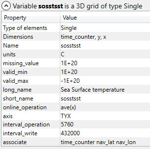
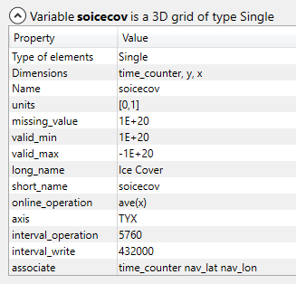
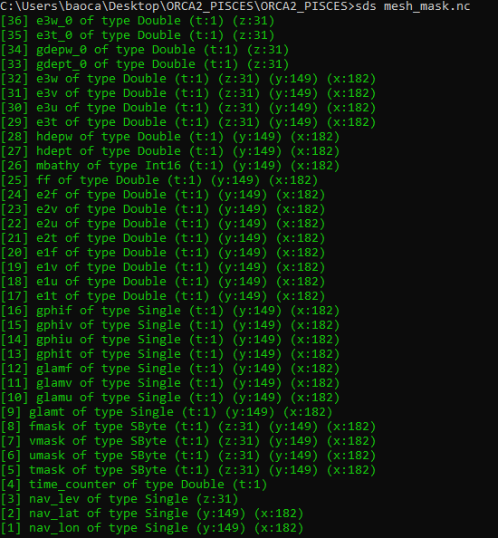

# Explore Data Set

# Part I  NEMO MODEL DataSet
## dyna_grid_T.nc
## dyna_grid_U.nc
## dyna_grid_V.nc
## dyna_grid_W.nc

## TIME 2092/01/01 --- 2092/12/31
# ==========================================================

# 1. dyna_grid_T.nc
## 1.1 info

## 2. variables/dimensions

## 3. description of variables/dimensions
### 3.1 [1] nav_lon of type Single (y:149) (x:182)

### 3.2 [2] nav_lat of type Single (y:149) (x:182)

### 3.3 [3] deptht of type Single (deptht:31)

### 3.4 [4] time_counter of type Single (time_counter:73)

s
### 3.5 [5] votemper of type Single (time_counter:73) (deptht:31) (y:149) (x:182)

### 3.6 [6] vosaline of type Single (time_counter:73) (deptht:31) (y:149) (x:182)

### 3.7 [7] sosstsst of type Single (time_counter:73) (y:149) (x:182)

### 3.8 [8] sosaline of type Single (time_counter:73) (y:149) (x:182)

### 3.9 [9] sossheig of type Single (time_counter:73) (y:149) (x:182)

### 3.10 [10] iowaflup of type Single (time_counter:73) (y:149) (x:182)

### 3.11 [11] sowaflep of type Single (time_counter:73) (y:149) (x:182)

### 3.12 [12] sowaflup of type Single (time_counter:73) (y:149) (x:182)

### 3.13 [13] sorunoff of type Single (time_counter:73) (y:149) (x:182)

### 3.14 [14] sowaflcd of type Single (time_counter:73) (y:149) (x:182)

### 3.15 [15] sosalflx of type Single (time_counter:73) (y:149) (x:182)

### 3.16 [16] sohefldo of type Single (time_counter:73) (y:149) (x:182)

### 3.17 [17] soshfldo of type Single (time_counter:73) (y:149) (x:182)

### 3.18 [18] somxl010 of type Single (time_counter:73) (y:149) (x:182)

### 3.19 [19] somixhgt of type Single (time_counter:73) (y:149) (x:182)

### 3.20 [20] soicecov of type Single (time_counter:73) (y:149) (x:182)

### 3.21 [21] sowindsp of type Single (time_counter:73) (y:149) (x:182)

### 3.22 [22] sohefldp of type Single (time_counter:73) (y:149) (x:182)

### 3.23 [23] sowafldp of type Single (time_counter:73) (y:149) (x:182)

### 3.24 [24] sosafldp of type Single (time_counter:73) (y:149) (x:182)

### 3.25 [25] sobowlin of type Single (y:149) (x:182)

# 2. dyna_grid_U.nc
## 1. info

## 2. variables/dimensions

## 3. description of variables/dimensions

### 3.1 [1] nav_lon of type Single (y:149) (x:182)

### 3.2 [2] nav_lat of type Single (y:149) (x:182)

### 3.3 [3] depthu of type Single (depthu:31)

### 3.4 [4] time_counter of type Single (time_counter:73)

### 3.5 [5] vozocrtx of type Single (time_counter:73) (depthu:31) (y:149) (x:182)

### 3.6 [6] sobblcox of type Single (time_counter:73) (y:149) (x:182)

### 3.7 [7] vozoeivu of type Single (time_counter:73) (depthu:31) (y:149) (x:182)

### 3.8 [8] sozotaux of type Single (time_counter:73) (y:149) (x:182)

# 3. dyna_grid_V.nc
## 1. info

## 2. variables/dimensions

## 3. description of variables/dimensions

### 3.1 [1] nav_lon of type Single (y:149) (x:182)

### 3.2 [2] nav_lat of type Single (y:149) (x:182)

### 3.3 [3] depthv of type Single (depthv:31)

### 3.4 [4] time_counter of type Single (time_counter:73)

### 3.5 [5] vomecrty of type Single (time_counter:73) (depthv:31) (y:149) (x:182)

### 3.6 [6] sobblcoy of type Single (time_counter:73) (y:149) (x:182)

### 3.7 [7] vomeeivv of type Single (time_counter:73) (depthv:31) (y:149) (x:182)

### 3.8 [8] sometauy of type Single (time_counter:73) (y:149) (x:182)

# 4. dyna_grid_W.nc
## 1. info

## 2. variables/dimensions

## 3. description of variables/dimensions

### 3.1 [1] nav_lon of type Single (y:149) (x:182)

### 3.2 [2] nav_lat of type Single (y:149) (x:182)

### 3.3 [3] depthw of type Single (depthw:31)

### 3.4 [4] time_counter of type Single (time_counter:73)

### 3.5 [5] vovecrtz of type Single (time_counter:73) (depthw:31) (y:149) (x:182)

### 3.6 [6] voveeivw of type Single (time_counter:73) (depthw:31) (y:149) (x:182)

### 3.7 [7] votkeavt of type Single (time_counter:73) (depthw:31) (y:149) (x:182)

### 3.8 [8] votkeevd of type Single (time_counter:73) (depthw:31) (y:149) (x:182)

### 3.9 [9] votkeavm of type Single (time_counter:73) (depthw:31) (y:149) (x:182)

### 3.10 [10] votkeevm of type Single (time_counter:73) (depthw:31) (y:149) (x:182)

### 3.11 [11] voddmavs of type Single (time_counter:73) (depthw:31) (y:149) (x:182)

### 3.12 [12] soleahtw of type Single (time_counter:73) (y:149) (x:182)

### 3.13 [13] soleaeiw of type Single (time_counter:73) (y:149) (x:182)

# ==========================================================

# Part II MESH MASK Domain

# 1. mesh_mask.nc
## 1. info

## 2. variables/dimensions

## 3. description of variables/dimensions

### 3.1 [1] nav_lon of type Single (y:149) (x:182)

### 3.2 [2] nav_lat of type Single (y:149) (x:182)

### 3.3 [3] nav_lev of type Single (z:31)

### 3.4 [4] time_counter of type Double (t:1)

### 3.5 [5] tmask of type SByte (t:1) (z:31) (y:149) (x:182)

### 3.6 [6] umask of type SByte (t:1) (z:31) (y:149) (x:182)

### 3.7 [7] vmask of type SByte (t:1) (z:31) (y:149) (x:182)

### 3.8 [8] fmask of type SByte (t:1) (z:31) (y:149) (x:182)

### 3.9 [9] glamt of type Single (t:1) (y:149) (x:182)

### 3.10 [10] glamu of type Single (t:1) (y:149) (x:182)

### 3.11 [11] glamv of type Single (t:1) (y:149) (x:182)

### 3.12 [12] glamf of type Single (t:1) (y:149) (x:182)

### 3.13 [13] gphit of type Single (t:1) (y:149) (x:182)

### 3.14 [14] gphiu of type Single (t:1) (y:149) (x:182)

### 3.15 [15] gphiv of type Single (t:1) (y:149) (x:182)

### 3.16 [16] gphif of type Single (t:1) (y:149) (x:182)

### 3.17 [17] e1t of type Double (t:1) (y:149) (x:182)

### 3.18 [18] e1u of type Double (t:1) (y:149) (x:182)

### 3.19 [19] e1v of type Double (t:1) (y:149) (x:182)

### 3.20  [20] e1f of type Double (t:1) (y:149) (x:182)

### 3.21 [21] e2t of type Double (t:1) (y:149) (x:182)

### 3.22 [22] e2u of type Double (t:1) (y:149) (x:182)

### 3.23 [23] e2v of type Double (t:1) (y:149) (x:182)

### 3.24 [24] e2f of type Double (t:1) (y:149) (x:182)

### 3.25 [25] ff of type Double (t:1) (y:149) (x:182)

### 3.26 [26] mbathy of type Int16 (t:1) (y:149) (x:182)

### 3.27 [27] hdept of type Double (t:1) (y:149) (x:182)

### 3.28 [28] hdepw of type Double (t:1) (y:149) (x:182)

### 3.29 [29] e3t of type Double (t:1) (z:31) (y:149) (x:182)

### 3.30 [30] e3u of type Double (t:1) (z:31) (y:149) (x:182)

### 3.31 [31] e3v of type Double (t:1) (z:31) (y:149) (x:182)

### 3.32 [32] e3w of type Double (t:1) (z:31) (y:149) (x:182)

### 3.33 [33] gdept_0 of type Double (t:1) (z:31)

### 3.34 [34] gdepw_0 of type Double (t:1) (z:31)

### 3.35 [35] e3t_0 of type Double (t:1) (z:31)

### 3.36 [36] e3w_0 of type Double (t:1) (z:31)

# ==========================================================

# Part III  PISCES MODEL DataSet

# 1. PISCES_1m_00010101_00020101_diad_T.nc
## 1. info

## 2. variables/dimensions

## 3. description of variables/dimensions

### 3.1 [1] nav_lon of type Single (y:149) (x:182)

### 3.2 [2] nav_lon of type Single (y:149) (x:182)

### 3.3 [3] deptht of type Single (deptht:31)

### 3.4 [4] deptht_bounds of type Single (deptht:31) (axis_nbounds:2)

### 3.5 [5] PH of type Single (time_counter:12) (deptht:31) (y:149) (x:182)

### 3.6 [6] time_centered of type Double (time_counter:12)

### 3.7 [7] time_centered_bounds of type Double (time_counter:12) (axis_nbounds:2)

### 3.8 [8] time_counter of type Double (time_counter:12)

### 3.9 [9] time_counter_bounds of type Double (time_counter:12) (axis_nbounds:2)

### 3.10 [10] PAR of type Single (time_counter:12) (deptht:31) (y:149) (x:182)

### 3.11 [11] PPPHY of type Single (time_counter:12) (deptht:31) (y:149) (x:182)

### 3.12 [12] PPPHY2 of type Single (time_counter:12) (deptht:31) (y:149) (x:182)

### 3.13 [13] PPNEWN of type Single (time_counter:12) (deptht:31) (y:149) (x:182)

### 3.14 [14] PPNEWD of type Single (time_counter:12) (deptht:31) (y:149) (x:182)

### 3.15 [15] PBSi of type Single (time_counter:12) (deptht:31) (y:149) (x:182)

### 3.16 [16] xfracal of type Single (time_counter:12) (deptht:31) (y:149) (x:182)

### 3.17 [17] PCAL of type Single (time_counter:12) (deptht:31) (y:149) (x:182)

### 3.18 [18] GRAZ1 of type Single (time_counter:12) (deptht:31) (y:149) (x:182)

### 3.19 [19] GRAZ2 of type Single (time_counter:12) (deptht:31) (y:149) (x:182)

### 3.20 [20] EPC100 of type Single (time_counter:12) (y:149) (x:182)

### 3.21 [21] EPSI100 of type Single (time_counter:12) (y:149) (x:182)

### 3.22 [22] EPCAL100 of type Single (time_counter:12) (y:149) (x:182)

### 3.23 [23] Cflx of type Single (time_counter:12) (y:149) (x:182)

### 3.24 [24] Dpco2 of type Single (time_counter:12) (y:149) (x:182)

### 3.25 [25] Oflx of type Single (time_counter:12) (y:149) (x:182)

### 3.26 [26] Dpo2 of type Single (time_counter:12) (y:149) (x:182)

### 3.27 [27] Kg of type Single (time_counter:12) (y:149) (x:182)

### 3.28 [28] Heup of type Single (time_counter:12) (y:149) (x:182)

### 3.29 [29] Irondep of type Single (time_counter:12) (y:149) (x:182)

### 3.30 [30] Ironsed of type Single (time_counter:12) (deptht:31) (y:149) (x:182)

### 3.31 [31] Nfix of type Single (time_counter:12) (deptht:31) (y:149) (x:182)

### 3.32 [32] MuN of type Single (time_counter:12) (deptht:31) (y:149) (x:182)

### 3.33 [33] MuD of type Single (time_counter:12) (deptht:31) (y:149) (x:182)

### 3.34 [34] LNnut of type Single (time_counter:12) (deptht:31) (y:149) (x:182)

### 3.35 [35] LDnut of type Single (time_counter:12) (deptht:31) (y:149) (x:182)

### 3.36 [36] LNFe of type Single (time_counter:12) (deptht:31) (y:149) (x:182)

### 3.37 [37] LDFe of type Single (time_counter:12) (deptht:31) (y:149) (x:182)

### 3.38 [38] LNlight of type Single (time_counter:12) (deptht:31) (y:149) (x:182)

### 3.39 [39] LDlight of type Single (time_counter:12) (deptht:31) (y:149) (x:182)

### 3.40 [40] pdust of type Single (time_counter:12) (y:149) (x:182)

